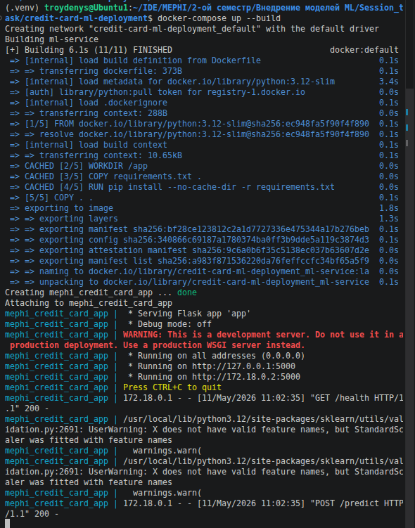
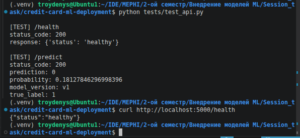

# 1. Описание проекта и его целей.

Разработка и внедрение сервиса прогнозирования дефолта по кредитным картам с контейнеризацией и A/B-тестированием. Проект выполняется в рамках сессионного задания по дисциплине "Внедрение моделей МЛ".

Цель проекта: разработать и внедрить в production-like-среду сервис машинного обучения для прогнозирования дефолта по кредитным картам, который охватывает полный цикл от сохранения модели до организации A/B-тестирования.


# 2. Структура репозитория.
```text
.
├── ab_test_plan.md          # План A/B тестирования модели
│
├── app                      # Основной API
│   ├── api.py               # Flask API: endpoints /predict, /health
│   ├── __init__.py          # Делает app Python-пакетом
│   └── model_handler.py     # Логика загрузки модели и инференса
│
├── data                     # Данные проекта
│   ├── artifacts            # Артефакты после обучения
│   │   ├── features.json    # Список признаков модели
│   │   ├── X_test.csv       # Тестовые признаки
│   │   └── y_test.csv       # Тестовые target-значения
│   │
│   └── UCI_Credit_Card.csv  # Исходный датасет
│
├── docker
│   └── Dockerfile           # Инструкция сборки Docker-образа
│
├── docker-compose.yml       # Запуск контейнеров через docker compose
│
├── models
│   ├── model_v1.pkl         # Обученная модель
│   └── train_model.py       # Скрипт обучения модели
│
├── README.md                # Документация проекта
│
├── requirements.txt         # Python-зависимости
│
└── tests
    └── test_api.py          # Тесты API
```
    
# 3. Инструкция по запуску (локально и в Docker).
## 3.1. Запуск проекта локально
### 3.1.1. Скачать репозиторий
```
git clone https://github.com/troydenys-git/mephi_inception_ML_models_TroyanDI.git
```

### 3.1.2. Установить зависимости 
```
pip install -r requirements.txt
```
### 3.1.3. Запустить приложение
```
python -m app.api
```
### 3.1.4. Запустить тест в соседнем терминале
```
python tests/test_api.py
```
## 3.2. Запуск проекта через Docker.
### 3.2.1. Предварительно выполнить шаги 3.1.1-3.1.2

### 3.2.2. Создать Docker-образ
```
docker build -t mephi_credit_card_app_troyandi -f docker/Dockerfile .
```

### 3.2.3. Запустить Docker-контейнер

### 3.2.4. Запустить тест в соседнем терминале
```
python tests/test_api.py
```
# 3.3. Запуск проекта через Docker Compose.
### 3.3.1. Предварительно выполнить шаги 3.1.1-3.1.2
### 3.3.2. Запустить Docker-compose
```
docker-compose up
```
### 3.3.3. Остановить Docker-compose
```
docker-compose down
```

# 4. Примеры запросов к API (curl-команды).

Команда для проверки эндпоинта /health. Эндпоинт /predict проверяется через тестовый файл.
```
 curl http://localhost:5000/health
```
# 5. Описание формата запросов и ответов.

Запрос:

- `GET /health` - нет тела запроса

Ответ:
```
{
  "status": "healthy"
}
```

- `POST /predict` 

Запрос

Сервис принимает случайно выбранный сэмпл в формате JSON с признаками клиента из тестовой части датасета UCI Credit Card Default.

Формат входа соответствует обучающему набору X (все признаки, кроме таргета default.payment.next.month).
```
{
  "LIMIT_BAL": 20000,

  "SEX": 2,

  "EDUCATION": 2,

  "MARRIAGE": 1,

  "AGE": 24,

  "PAY_0": -1,

  "PAY_2": -1,

  "PAY_3": 0,

  ...
}
```
Особенности:

- все поля обязательны,

- порядок не важен (он фиксируется через features.json),

- типы: int / float

Ответ 
```
{
  "prediction": 0,

  "probability": 0.12,

  "model_version": "v1",

  "true_label": 0
}
```
В ответе выводятся: предсказание модели, вероятность класса, версия модели, истинное значение класса.

# 6. Ссылка на Docker-образ в Docker Hub.
```
https://hub.docker.com/repository/docker/troydenys/mephi_credit_card_app_troyandi/general
```
```
docker pull troydenys/my-mephi_credit_card_app_troyandi:latest
```
# Скриншоты запуска сервиса и тестовых команд




# 7. Требования к проекту
## 7.1. Часть 1. Подготовка модели к production и деплой
- Обучена модель логистической регрессии на представленном датасете.
- Модель сохранена с использованием pickle.
- Функция для загрузки модели отражена в `/app/model_handler.py`
- Реализован веб-сервер на Flask с эндпоинтами `POST /predict`, `GET /health`
- Формат запроса/ответа описан в данном файле в п. `# 5. Описание формата запросов и ответов.`
### В документации опишите, как можно преобразовать модель в формат ONNX-ML для оптимизации.

ONNX (Open Neural Network Exchange) — это открытый стандарт для обеспечения совместимости моделей машинного обучения. Он позволяет разработчикам искусственного интеллекта использовать модели с различными инфраструктурами, инструментами, средами исполнения и компиляторами.
Часто стандарт ONNX и его библиотеки используют для конвертации из одного фреймворка в другой (например, из PyTorch в TensorFlow для использования в продакшене). Для конвертации различных фреймворков (не только DL) в формат ONNX и обратно существует ряд библиотек.

Преобразование выполняется после обучения и сохранения модели. Сначала обученная модель или pipeline экспортируется в формат ONNX с помощью специальных библиотек конвертации (например, skl2onnx). После этого модель может использоваться через ONNX Runtime без необходимости загружать исходные библиотеки машинного обучения, например scikit-learn.


### Объясните, для чего используются uWSGI + NGINX в production-среде.

uWSGI — это веб-сервер, который запускает Python-приложения через протокол WSGI. У этого веб-сервера есть и специальная версия протокола WSGI, которая называется uwsgi.
NGINX — это веб-сервер, который оптимизирует нагрузку за счёт асинхронной архитектуры, управляемой событиями. Говоря простым языком, архитектура использует одно ядро на один процесс. При этом в одном процессе могут быть сотни тысяч входящих запросов от каждого пользователя. Совместная параллельная обработка позволяет не создавать новые потоки для каждого соединения — это быстро и удобно. Такая высокая производительность делает NGINX самым популярным веб-сервером в мире.

Это необходимо для обхода следующего механизма:
Дело в механизме под названием GIL — Global Interpreter Lock. Он заключается в том, что в любом процессе Python одновременно может работать только один тред (один конкретный поток).
Таким образом, процесс Python не может утилизировать многоядерные системы. Для нашей задачи написания веб-сервера это означает, что сервер на Python одновременно может обрабатывать только один запрос, и это очень серьёзное ограничение даже для самых простых сервисов.
Хитрость заключается в том, что, раз один процесс может выполнять только один тред на одном ядре, мы просто запустим несколько процессов, чтобы они работали параллельно.

Существует несколько специализированных веб-серверов, решающих эту задачу, и все они имеют разную степень собазовый файл docker-compose.ymlвместимости с веб-фреймворками Python. Однако принцип работы у них один: вы запускаете команду старта веб-сервера и передаёте в неё в качестве параметра указание на скрипт, в котором написано ваше приложение. Эта команда запустит несколько рабочих процессов (копий главного скрипта), а сама будет заниматься прослушиванием входящих запросов и передавать их на обработку в один из запущенных процессов.
Для Flask используются веб-серверы Gunicorn, связка NGINX + uWSGI и ещё несколько менее популярных.

## 7.2. Часть 2. Воспроизводимость и контейнеризация
- файл requirements.txt со всеми зависимостями проекта создан в репозитории, для изоляции окружения был использован `venv`.
- Dockerfile доступен в `/docker/Dockerfile`, Docker-образ собран, протестирован и загружен на Docker Hub. Образ включает модель, код сервиса, все зависимости, веб-сервис запускается на порту 5000. Ссылка на Docker Hub в п. `# 6. Ссылка на Docker-образ в Docker Hub` в данном документе.

## 7.3. Часть 3. Сервисная архитектура и оркестрация
### Монолит vs микросервисы

В проекте выбран монолитный подход, так как сервис имеет небольшую структуру: API, загрузка ML-модели и инференс находятся в одном приложении.

Монолитная архитектура позволяет:

- упростить разработку и тестирование;
- быстро развернуть сервис через Docker;
- избежать лишней сложности инфраструктуры.

Использование микросервисов для данного учебного проекта избыточно, поскольку отсутствует высокая нагрузка, большое количество сервисов и необходимость независимого масштабирования компонентов.

### Концепт брокеров сообщений

При масштабировании проекта можно использовать брокер сообщений, например RabbitMQ, для асинхронного взаимодействия между сервисами.

Брокер сообщений мог бы применяться для:

- асинхронной обработки batch-предсказаний;
- очередей запросов при высокой нагрузке;
- логирования и мониторинга;
- фоновой обработки задач;

Например, API-сервис мог бы отправлять запросы на предсказание в очередь RabbitMQ, а отдельный worker-сервис — обрабатывать их независимо от основного приложения. Это позволило бы:

- снизить нагрузку на API;
- повысить отказоустойчивость;
- масштабировать обработчики независимо друг от друга;
- избежать потери запросов при временных сбоях.

В текущем проекте принято решение не использовать брокер сообщений, так как нагрузка и архитектура сервиса остаются небольшими.

### Логирование и мониторинг

В проекте запросы и ответы API могут логироваться с помощью стандартной библиотеки Python logging в формате JSON. В логах могут храниться:

- время запроса;
- endpoint;
- HTTP-метод;
- статус ответа;
- результат предсказания;
- сообщения об ошибках.

Каждый сервис может хранить собственные логи независимо, после чего они могут централизованно собираться агрегатором логов.

Для мониторинга и централизованного логирования в production-системах часто используется стек ELK:

- Logstash — собирает и агрегирует логи сервисов;
- Elasticsearch — хранит, индексирует и позволяет искать логи;
- Kibana — визуализирует данные и отображает дашборды мониторинга.

Также для мониторинга метрик могут использоваться:

- Prometheus — сбор и хранение метрик;
- Grafana — визуализация метрик и построение дашбордов.

Такой подход позволяет отслеживать состояние сервисов, ошибки, нагрузку и производительность системы в реальном времени.

### Оркестрация (Docker Compose — опционально, бонус).

- В проекте создан базовый файл docker-compose.yml, который запускает сервис. Запуск описан в п. `# 3.3. Запуск проекта через Docker Compose`.

### Обзор инструментов MLOps

В рамках жизненного цикла модели машинного обучения важно не только обучить модель, но и обеспечить удобное управление данными, воспроизводимость экспериментов и контроль версий артефактов. Для этого используются специализированные инструменты MLOps, среди которых DVC и MLflow.

#### DVC (Data Version Control)

DVC — это инструмент для контроля версий данных, моделей и промежуточных результатов в ML-проектах. Он дополняет Git и решает его основное ограничение — невозможность эффективно хранить большие файлы, такие как датасеты и обученные модели.

#### MLflow

MLflow — это платформа для управления жизненным циклом ML-моделей и отслеживания экспериментов. Основная задача MLflow — фиксировать параметры обучения, используемые данные и итоговые метрики моделей.

Использование MLflow позволяет систематизировать процесс разработки модели и упростить анализ результатов экспериментов. 

### Бизнес-метрики

Помимо технических метрик качества модели (F1-score, Precision, Recall), для заказчика важно оценивать экономический эффект от внедрения модели прогнозирования дефолта по кредитным картам. Ниже приведен пример бизнес-метрики:

#### Увеличение доли одобренных заявок при сохранении уровня риска

Если модель более точно разделяет надёжных и рискованных клиентов, банк может:

- одобрять больше заявок надёжным клиентам;
- сохранять допустимый уровень кредитного риска.

Метрика может рассчитываться как:

- отношение количества одобренных заявок после внедрения модели к количеству заявок до внедрения;
- при условии, что доля дефолтов остаётся на прежнем уровне или снижается.

Например:

- старая система одобряла 60 % заявок;
- новая модель позволяет одобрять 70 % заявок;
- при этом уровень дефолтов остаётся неизменным.

Это означает рост прибыли за счёт увеличения количества выданных кредитов без существенного роста финансовых рисков.

Для итоговой оценки эффективности внедрения модели также может использоваться показатель ROI (Return on Investment). Он позволяет сравнить экономический эффект от снижения потерь и роста прибыли со стоимостью разработки, внедрения и поддержки ML-сервиса.